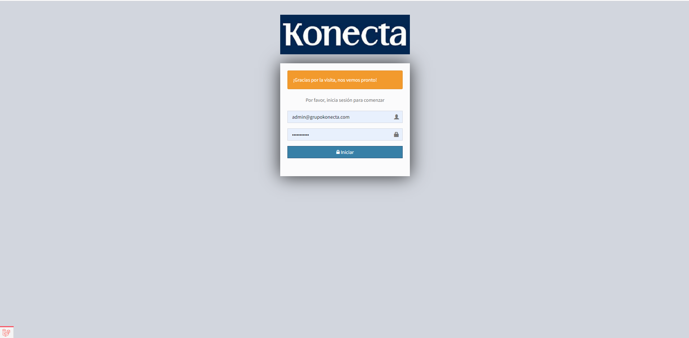
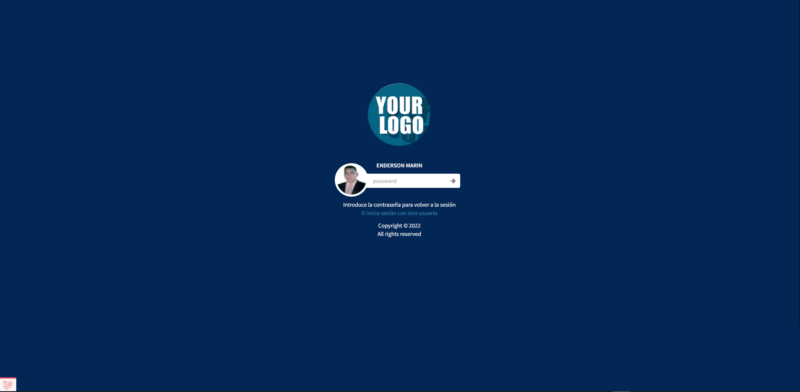
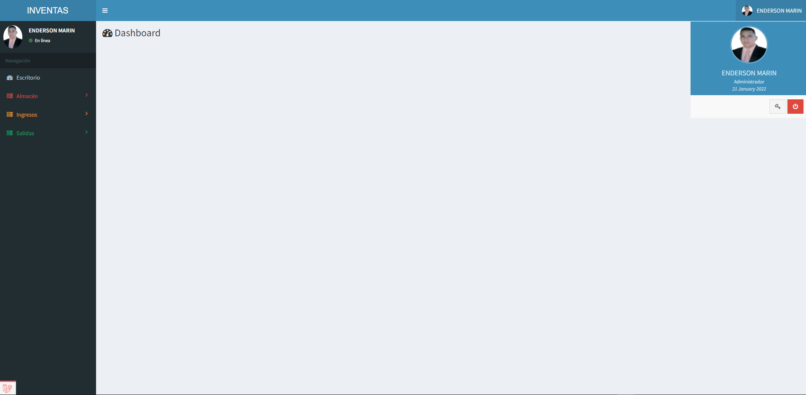
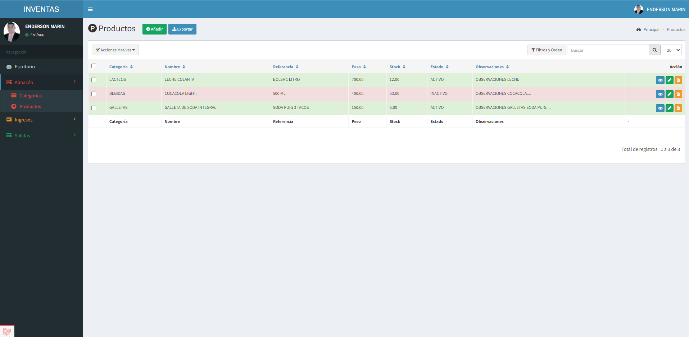
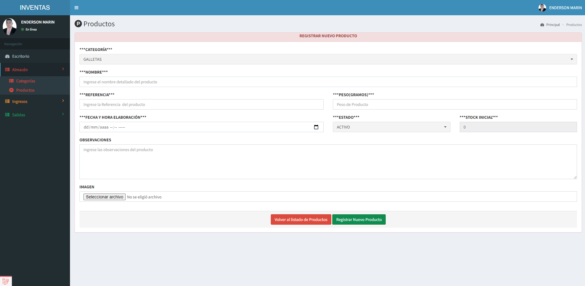
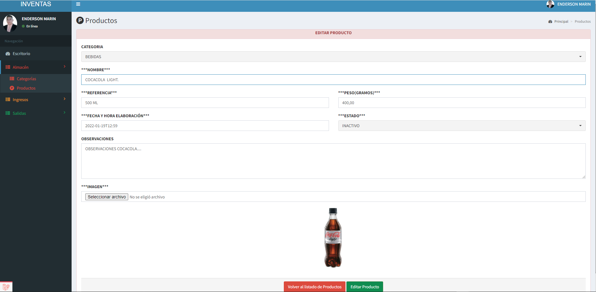
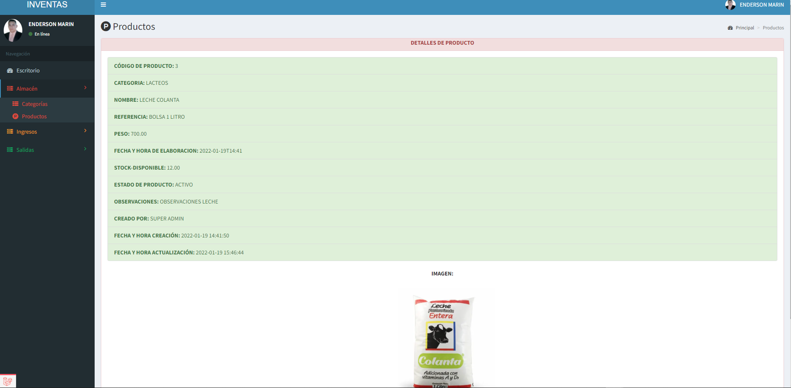
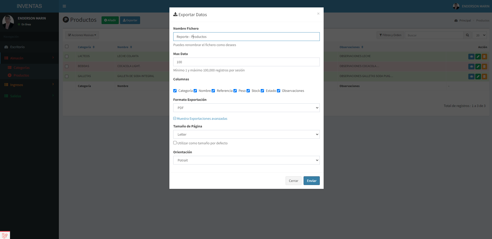

# Project Title

INVENTARIO - PUNTO DE VENTA

# Screenshot










## Getting Started

You can run this application in two ways:

### Option 1: Docker Development Environment (Recommended)

The easiest way to get started is using Docker. This provides a complete development environment with PHP, Nginx, MySQL, and phpMyAdmin pre-configured.

**Quick Start:**

```bash
# Clone the repository
git clone https://github.com/ENDERSON-MARIN/INVENTARIO-PUNTO-VENTA.git
cd project_dir

# Run the automated setup script
bash scripts/setup.sh
```

That's it! The application will be available at:

- **Application**: http://localhost:8000
- **phpMyAdmin**: http://localhost:8080

**Manual Docker Setup:**

```bash
# Copy environment configuration
cp .env.docker .env

# Start containers
docker-compose up -d

# Generate application key
docker-compose exec php php artisan key:generate
```

**Common Docker Commands:**

```bash
# View logs
docker-compose logs -f

# Stop containers
docker-compose stop

# Restart containers
docker-compose restart

# Run artisan commands
docker-compose exec php php artisan [command]

# Run composer commands
docker-compose exec php composer [command]
```

For detailed Docker documentation, see [docs/README.docker.md](docs/README.docker.md)

### Option 2: Traditional Setup

If you prefer not to use Docker, you can install the dependencies manually.

**Prerequisites:**

You need to install the following software:

1. COMPOSER https://getcomposer.org/download/
2. WEB SERVER (PHP 7.4+, APACHE)
3. DATABASE MYSQL 5.7+
4. OTHER OPTIONS:
    - laragon https://laragon.org/download/index.html
    - xampp https://www.apachefriends.org/download.html
    - wamp https://sourceforge.net/projects/wampserver/files/latest/download

**Setup Steps:**

```bash
# Clone the repository
git clone https://github.com/ENDERSON-MARIN/INVENTARIO-PUNTO-VENTA.git
cd project_dir

# Copy environment file
cp .env.example .env

# Configure database in .env file:
# DB_CONNECTION=mysql
# DB_HOST=127.0.0.1
# DB_PORT=3306
# DB_DATABASE=Your_Database_Here
# DB_USERNAME=Your_Username_Here
# DB_PASSWORD=Your_password_Here

# Install Composer dependencies
composer install

# Install NPM dependencies
npm install

# Compile assets
npm run dev

# Generate application key
php artisan key:generate

# Run migrations
php artisan migrate

# Start development server
php artisan serve --port 5000
```

The application will be available at http://localhost:5000

## Author

- [Enderson Marín](https://github.com/ENDERSON-MARIN)

## License

This project is licensed under the MIT License - see the [LICENSE.md](LICENSE.md) file for details

## Web Site:

- https://www.marinenderson.com
